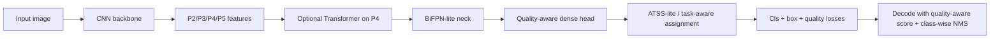

# Hybrid V3 Spec

## Purpose

This document defines a concrete implementation plan for `Hybrid v3`, the next detector iteration after the current `Hybrid v2`.

The goal is not to make the model larger first. The goal is to fix the detector formulation so the lightweight CNN family can compete more fairly with the baseline on:

- in-domain AP
- small-defect sensitivity
- later cross-dataset robustness

This spec is intentionally explicit and file-oriented so the implementation can stay simple and ablation-friendly.

## Why V3 Is Needed

Current mid-run results show:

- `baseline mid`: `mAP50=0.2783`, `mAP50_95=0.0940`
- `hybrid_cnn mid`: `mAP50=0.1656`, `mAP50_95=0.0447`
- `hybrid_cnn_transformer_p2 mid`: `mAP50=0.1401`, `mAP50_95=0.0479`

Interpretation:

- `Hybrid v2` is trainable.
- `Hybrid v2` is still clearly behind the baseline under the same protocol.
- The main gap is detector quality, not preprocessing.
- `Transformer` is not the main missing ingredient.
- `P2` does not help enough while assignment and ranking are still weak.

Therefore `Hybrid v3` should focus first on:

1. better positive/negative assignment
2. better ranking between classification and localization quality
3. better lightweight multi-scale fusion

## V3 Design Summary

`Hybrid v3` remains a lightweight CNN-dominant detector.

Core design:

- CNN backbone remains the main feature extractor
- optional 1 Transformer block stays only as an ablation
- `P2` stays because the dataset is strongly small-object-heavy
- neck is upgraded from simple top-down FPN to `BiFPN-lite`
- head becomes `quality-aware anchor-free`
- assignment is upgraded from plain center sampling to `ATSS-lite`

High-level pipeline:

## Supported Ablations

`V3` should support the same four clean ablations:

1. `E1`: CNN
2. `E2`: CNN + Transformer
3. `E3`: CNN + P2
4. `E4`: CNN + Transformer + P2

Implementation rule:

- The detector core must be shared.
- The only ablation switches are:
  - `use_transformer`
  - `use_p2_branch`
  - optionally `num_transformer_blocks=0/1`

Do not create separate model codepaths per ablation.

## File-by-File Spec

### 1. `src/models/backbones/cnn_backbone.py`

Status in v2:

- already lightweight
- already CNN-dominant
- not the main bottleneck

Required changes for v3:

- keep depthwise-separable backbone structure
- keep `GroupNorm`
- keep `P2` to `P5` outputs
- increase capacity only slightly if needed

Target default backbone:

- `stem_channels: 24 or 32`
- `stage_channels: (64, 128, 192, 256)` stays acceptable
- `stage_depths: (1, 2, 3, 2)` stays acceptable

Do not add:

- CSP/C2f modules
- heavy residual stacks
- pretrained external backbone frameworks

Acceptance criteria:

- same input/output interface as current backbone
- same output feature names: `p2`, `p3`, `p4`, `p5`

### 2. `src/models/backbones/transformer_block.py`

Status in v2:

- lightweight and acceptable
- not the current priority bottleneck

Required changes for v3:

- keep only 1 optional block on `P4` by default
- allow `0` or `1` block in configs
- preserve shape and feature naming

Do not:

- add multi-level attention
- add DETR-style encoder stacks
- add transformer on `P2` or `P3`

Acceptance criteria:

- `use_transformer=false` leaves the detector core identical
- `use_transformer=true` only refines `P4`

### 3. `src/models/necks/light_neck.py`

This file needs the most important structural change after assignment/head.

Status in v2:

- simple top-down FPN only
- too weak for robust multi-scale fusion

Required v3 change:

- replace current neck with `BiFPN-lite`

Minimum design:

- inputs: `p2`, `p3`, `p4`, `p5`
- repeated fusion depth: `1` by default
- weighted feature fusion with learnable positive weights
- depthwise-separable output conv after fusion

Expected outputs:

- `E1/E2`: `p3`, `p4`, `p5`
- `E3/E4`: `p2`, `p3`, `p4`, `p5`

Do not:

- add full PANet
- add heavy repeated FPN blocks
- add more than one BiFPN repeat in the first V3 pass

Acceptance criteria:

- same output naming as current code
- lightweight enough to stay close to current hybrid compute budget

### 4. `src/models/heads/detection_head.py`

This file is the biggest functional upgrade.

Status in v2:

- decoupled head exists
- output is still only `cls`, `box`, `centerness`
- ranking remains weak

Required v3 change:

- replace current head with `quality-aware dense head`

Recommended outputs per level:

- `cls_logits`: `C`
- `bbox_distribution` or `bbox_ltrb`: `4` or `4 x reg_max`
- `quality_logits`: `1`

Preferred option:

- use `Distribution Focal Loss` style box representation with a small `reg_max` like `8`

Fallback option if keeping implementation simpler:

- keep direct `LTRB` regression
- still add a dedicated `quality_logits` branch that estimates localization quality

Head towers:

- classification tower: `2` depthwise-separable blocks
- regression tower: `2` depthwise-separable blocks
- quality branch attached to regression tower

Scoring rule at inference:

- use a quality-aware score, not plain `cls * centerness`
- preferred:
  - `score = sigmoid(cls) * sigmoid(quality)`

Do not:

- keep multi-class-per-point decoding
- keep centerness as the only ranking factor

Acceptance criteria:

- same style train/eval interface as current head
- cleanly reusable across all 4 ablations

### 5. `src/models/hybrid_detector.py`

This file will carry most of the detector logic updates.

Required v3 changes:

#### Assignment

Replace current center-sampling assignment with `ATSS-lite`.

Minimum `ATSS-lite` behavior:

- candidate positives selected across levels by center distance
- adaptive IoU threshold per GT
- assign multiple positive points/locations per object
- keep smallest-area preference when conflicts occur

If full ATSS proves too large to implement in one step:

- use `task-aligned assignment lite`
- still ensure multiple positives per GT
- still use IoU-aware matching rather than only inside-center rules

This is the highest-priority algorithmic change in v3.

#### Loss

Current v2 loss:

- focal classification
- GIoU box
- BCE centerness

V3 target:

- classification: focal or varifocal-style quality-aware classification
- box regression: GIoU or CIoU
- box distribution loss: optional DFL if distribution regression is used
- quality loss: BCE or quality focal style

Recommended total loss:

- `L = L_cls + 2.0 * L_box + 0.5 * L_quality (+ 0.25 * L_dfl if used)`

#### Decode

Update inference decode to:

- one best class per point
- quality-aware score
- per-level top-k
- class-wise NMS
- final `max_detections`

#### Input normalization

- keep current input normalization

#### Output logging/debugging

Add lightweight debugging counters if needed:

- number of positive assignments
- mean quality score
- predictions above threshold before NMS

Acceptance criteria:

- training still uses `model(images, targets)`
- inference still uses `model(images)`
- exported predictions remain compatible with current evaluator

### 6. `src/losses/detection_loss.py`

Required v3 additions:

- keep existing focal and GIoU helpers
- add:
  - `quality_focal_loss` or simple IoU-aware BCE helper
  - optional `distribution_focal_loss`

Do not add a large external loss framework.

Acceptance criteria:

- all losses remain plain PyTorch helpers
- loss code stays short and readable

### 7. `src/engine/trainer.py`

No large redesign needed.

Small required upgrades:

- keep current epoch-level logging
- optionally log:
  - `val_preds`
  - `mean_positive_assignments`
  - `mean_quality_score`

Useful for V3 debugging:

- if `ATSS-lite` is broken, the first sign will often be assignment count collapse or explosion

### 8. `src/engine/evaluator.py`

No major redesign required.

Keep:

- same metric computation
- same output files

Optional additions for V3 debugging:

- export score distribution summary
- export prediction count per image summary

These are optional, not required for first V3 pass.

### 9. `configs/`

Config policy for V3:

- keep the current CLI override approach
- avoid creating many new YAML files

Add only the minimum needed:

- one base `train_hybrid_v3.yaml`
- one base `eval_hybrid_v3.yaml`
- one smoke config only if really needed

All ablations should be controlled by CLI:

- `--variant cnn`
- `--variant cnn_transformer`
- `--variant cnn_p2`
- `--variant cnn_transformer_p2`

Recommended base defaults for V3:

- `learning_rate: 1e-4`
- `batch_size: 4`
- `score_threshold: 0.1`
- `pre_nms_topk: 200`
- `max_detections: 50`
- `neck: bifpn_lite`
- `assignment: atss_lite`
- `quality_head: true`

### 10. `tests/`

Add only minimal direct tests:

- head forward output shape test
- assignment smoke test on a tiny synthetic example
- detector train/eval forward sanity
- config load test for V3 base config

Do not create large test infrastructure.

## Implementation Order

This order matters.

### Phase 1

- upgrade `detection_head.py`
- add V3 losses in `detection_loss.py`
- update `hybrid_detector.py` decode and quality-aware scoring

Goal:

- improve ranking before touching neck complexity

### Phase 2

- replace current assignment with `ATSS-lite`

Goal:

- improve positive sampling and localization learning

### Phase 3

- replace neck with `BiFPN-lite`

Goal:

- improve multi-scale fusion, especially for `P2`

### Phase 4

- re-enable optional transformer ablation on top of the stronger detector core

Goal:

- test whether transformer adds value after detector formulation is fixed

## Evaluation Plan for V3

Minimum validation ladder:

1. smoke
   - 1 epoch
   - tiny subset
   - pass/fail only

2. micro
   - `256 train / 64 val / 3 epochs`
   - used to see whether metric leaves zero and prediction count stays sane

3. mid
   - `1024 train / 256 val / 8 epochs`
   - used for fair comparison against baseline mid

4. full
   - only for variants that pass `mid`

Decision rule:

- if `E1 v3` does not clearly beat `E1 v2` on `mid`, stop and revisit core design
- only run `E4 v3` full if it beats `E1 v3` on `mid`

## Success Criteria

`V3` is worth continuing only if:

- `E1 v3 mid` clearly exceeds `E1 v2 mid`
- `E4 v3 mid` gives a real improvement over `E1 v3 mid`
- prediction counts are stable and not saturating max detections

Practical target for first V3 pass:

- beat current `E1 v2 mid`
  - `mAP50 > 0.1656`
  - `mAP50_95 > 0.0447`

Stronger target:

- close part of the gap to `baseline mid`
  - `mAP50_95` should move materially toward `0.0940`

## Non-Goals

Do not do these in the first V3 pass:

- DETR-style matching
- large transformer stacks
- semantic maps
- segmentation branches
- external detection frameworks
- broad codebase redesign

## Bottom Line

`Hybrid v3` should not be "v2 plus more transformer".

It should be:

- lightweight CNN backbone
- optional transformer later
- `P2` retained
- `BiFPN-lite`
- `ATSS-lite`
- quality-aware dense head

That is the most direct path to making the hybrid family meaningfully stronger while keeping the repo simple and ablation-friendly.
